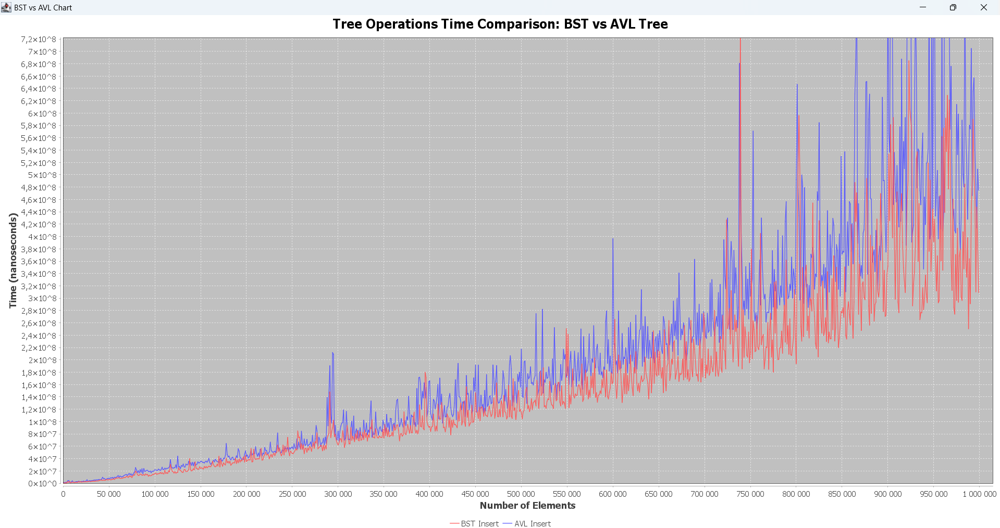
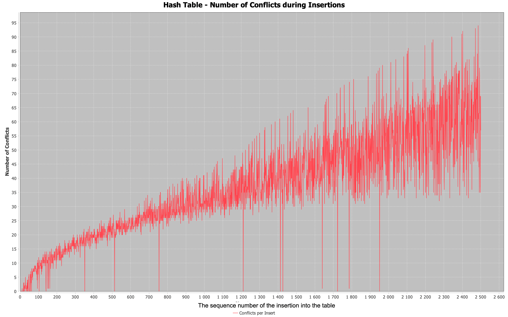

# Programmeringsuppgift-2

This is a Maven project that contains six different tasks (Uppgift 1, 2, 3, 4, 5 and 6). Each "uppgift" is independent and can be run individually. This project implements several data structures and algorithms, including deques, queues, binary search trees, balanced trees, and hash tables. Here’s a brief description of each task:

- Task 1: Generic Deque
A generic deque allows adding/removing elements from both ends, functioning as a stack or queue. It includes size, isEmpty, addFirst, addLast, removeFirst, and removeLast methods, along with an iterator for traversal.

- Task 2: Randomized Queue
A queue where dequeue() randomly removes and returns an element. Supports size, isEmpty, enqueue, and dequeue methods, with an iterator that iterates in random order.

- Task 3: Binary Search Tree (BST)
A BST with methods for height, size, add, remove, and contains, as well as in-order, pre-order, and post-order traversal. It also includes a method to remove the k-th largest element.

- Task 4: Balanced vs. Unbalanced Tree
A balanced tree (e.g., AVL or red-black) is compared with a regular BST. The comparison covers tree height and operation times, with an attached report detailing the results.

- Task 5: Hash Table with Quadratic Probing
A hash table using quadratic probing to resolve collisions, ensuring efficient handling of conflicts.

- Task 6: Vehicle Hash Table
Extends the hash table to store vehicle information, using registration numbers for hashing. An experiment analyzes hash function performance, focusing on collision frequency.

## Prerequisites
Before running the project, ensure you have the following tools installed on your computer:

- Java Development Kit (JDK) (version 8 or higher)
- Apache Maven

## Running the Application
### Using Maven from the Command Line:
- First, clone the repository or download the project directory to your computer.
- Navigate to the root directory of the project using your terminal/command line.
- To run a specific "uppgift", use the following command:

mvn exec:java -Dexec.mainClass="com.mycompany.app.UppgiftX"
Replace UppgiftX with the number of the task you want to run. For example:

- To run Uppgift 1, use:
mvn exec:java -Dexec.mainClass="com.mycompany.app.Uppgift1"

- To run Uppgift 2, use:
mvn exec:java -Dexec.mainClass="com.mycompany.app.Uppgift2"

The process is the same for other tasks (Uppgift 3, 4, 5och6).

# Analys report 

## Assignment 4
### Experiment 1
1. Binary Search Tree (BST) - values are inserted in sorted order

Unbalanced BST:
The binary search tree from the first experiment is an unbalanced BST, which looks like a list.
In the code, we see two rounds of insertions and deletions. When values are inserted in sorted order, a BST becomes unbalanced, leading to a skewed structure. This is because the tree does not automatically balance itself, and each inserted node becomes either the left or right child of the previous node, depending on the comparison.
The resulting tree root has a height n-1, which leads to inefficient operations:
- Search: in the worst case, because we might have to traverse all nodes.
- Insertions: insertion could take us through the entire tree (acting like a linked list).
- Deletions: we may have to traverse the entire tree to find the node to delete.

2. AVL Tree - values are inserted in sorted order

Balanced AVL Tree:
If we use an avl tree for the same data and exactly the same insertion and deletion order we get a well-structured, balanced AVL tree. AVL trees automatically adjust after every insertion or deletion to maintain a balance condition.
In the AVL tree, the height difference (balance factor) between the left and right subtrees for any node is at most 1. If this difference exceeded 1 after an insertion or deletion, the tree performed rotations to rebalance. 
The rotations ensured that the AVL tree maintains a logarithmic height, which improves the efficiency of operations:
Search: O(log n), as the tree is always balanced.
Insertions/Deletions: O(log n) due to the balancing operations and the logarithmic height.
The expected height is 1.44 ⋅ log2 30 − 1.328 = 5.74 - our AVL tree has height 6 as expected.

3. Comparison of Heights:
- Height of AVL Tree: 6
- Height of BST: 25

This shows that the AVL tree remains balanced and efficient, while the unbalanced BST grows in height, leading to slower operations. The significantly lower height of the AVL tree illustrates its efficiency in maintaining balance, resulting in faster operations (for larger datasets) compared to the unbalanced BST, which suffers from increased height and slower performance.

### Experiment 2

Binary Search Tree
The nodes in the second tree are inserted in a randomized order, leading to a more balanced structure than the first experiment. Although this BST is not perfectly balanced, its branches are more uniformly distributed, resulting in improved operational efficiency.
This tree is closer to what a naturally grown tree looks like when insertions occur without a predefined pattern (such as ascending or descending order).

- Structure: This tree is not skewed like the one from the first experiment. Instead, its branches grow more uniformly in different directions, which leads to a better balance than the first tree but not as optimal as a self-balancing tree.

- Height = 9: The height is significantly less than the height of the unbalanced BST, meaning that the operations will be more efficient than in the first case. According to Mark Allen Weiss an average binary tree has height Θ(√n‾). As a result of the insertions and deletions performed during this experiment, the height of the binary search tree is above the average with height of 9 and the average for the tree that has 30 nodes is ≈ 5.477

- Operations:
Search: In the average case, the search time is O(log n), but in the worst case, it could still reach O(n) (if all insertions happen in a way that forms a degenerate structure).
Insertion/Deletion: O(log n) on average but O(n) in the worst case.

The second, more randomly built BST is significantly more efficient and better structured than the first one. While it does not guarantee the perfect balance like an AVL tree, it avoids the extreme inefficiency of the first tree that behaves like a linked list. This randomness in insertion prevents the tree from becoming completely skewed, ensuring that operations perform much faster, on average, than in the unbalanced BST.

AVL Tree
In an AVL tree, the order in which elements are inserted or deleted does not affect the structure of the tree. Whether elements are inserted and deleted in random order or sequentially (from smallest to largest), the tree remains equally balanced. This is because the AVL tree automatically rebalances itself after every insertion or deletion, ensuring that its height stays logarithmic and that all operations remain efficient regardless of the order in which elements are handled.

However, inserting elements in sequential order (from smallest to largest) takes more time compared to random insertions. This is because the tree requires rebalancing after almost every insertion in sequential order, which adds to the overall time complexity.

#### TIME COMPARATION FOR THE EXPERIMENT 2: 
Time for BST operations: 949,907,916 ns (around 950 ms)
Time for AVL operations: 1,821,654,083 ns (around 1.82 seconds)

This shows that AVL tree operations took more time compared to the same operations on the Binary Search Tree (BST). 
Why this might be the case and what factors could contribute to the difference in performance:

1. Balancing Overhead in AVL Trees
AVL trees maintain a strict balance after every insertion and deletion, ensuring that the tree's height remains logarithmic (O(log n) height). However, the cost of maintaining this balance involves additional rotations after insertions or deletions.

These rotations can make AVL operations slower compared to BSTs for small datasets. For each insertion and deletion, AVL trees must check the balance factor and potentially perform one or two rotations to restore balance, while BSTs simply add or delete nodes without rebalancing.

BST does not enforce balance, so while insertions and deletions can be faster, the tree can become skewed (unbalanced), leading to worse performance over time (O(n) in the worst case). However, in your specific test, where values are inserted in ascending order, the performance doesn't immediately degrade because of the fixed small dataset size.

2. Effect of Dataset Size
The test dataset (50–75 values) is relatively small. In such a case, the overhead of balancing in AVL trees becomes more apparent because we are not yet seeing the benefits of maintaining balance (since the tree is small enough that the depth does not degrade much).
If we were working with much larger datasets, the AVL tree would start to outperform the BST as it keeps the height small, while the BST could become highly unbalanced, leading to slow operations in worst-case scenarios.

3. Tree Structure After Operations
After the insertions and deletions, the BST is likely more unbalanced, potentially degenerating into a linear structure for certain patterns of insertions. The AVL tree, on the other hand, would remain balanced, which means future insertions, deletions, and lookups in the AVL tree would be faster than in an unbalanced BST.

4. Graph Printing Overhead
If printGraph() in both cases also measures the time of the operations, and if printing an AVL tree is slower due to its structure, this could also explain some of the time difference. However, this would only be a minor contribution.

### Experiment 3
[Experiment code](./src/main/java/com/mycompany/treecomparation/TimeComparationBstVsAvl.java)

In this experiment, I are comparing the performance of two tree data structures: Binary Search Tree (BST) and AVL Tree (a balanced version of BST). The goal is to measure and analyze the time taken for three key operations:
- Insert
- Delete
- Contains (Search)
These operations are tested with varying numbers of elements, from 0 to 1,000,000, and the time taken for each operation is recorded in nanoseconds.

Random Input:
For each tree, random numbers are generated and inserted into the trees.
The same random values are used to ensure fair comparisonand deletation across both data structures. Only one contains ande delete operation is performed for every random values set.
The experiment is conducted for an increasing number of elements, from 0 up to 1,000,000, with results being recorded at intervals of 1,000 elements.
Measurement:
The time for each operation is measured using the Timer class, which uses System.nanoTime() to get the execution time in nanoseconds.
Each operation (Insert, Delete, Contains) is tested separately for both BST and AVL.

3. Results
Below are the observations for each operation based on the results you provided:

1. Insert Operation

- BST Insert: The insertion time increases gradually as the number of elements grows, but we observe that the time increases more smoothly compared to AVL.
- AVL Insert: AVL trees maintain balance after every insertion, and this rebalancing adds an overhead. The insertion time for AVL shows more fluctuation and higher time costs.
- Conclusion: Insertion in AVL trees takes more time compared to BST because AVL performs additional balancing operations to maintain its structure.

2. Contains Operation 

- BST Contains: The time to search for an element (using the contains method) in a Binary Search Tree (BST) is generally longer compared to an AVL tre. This difference is due to the lack of balancing in the BST, which often results in a higher tree height. As a result, the search operation in the BST takes longer compared to the AVL tree, which maintains a balanced structure and, therefore, a lower tree height.
- AVL Contains: AVL trees provide faster and more consistent search times due to the balanced nature of the tree.
- Conclusion: AVL trees outperform BST in terms of search operations because their height is consistently logarithmic, while an unbalanced BST can degenerate, leading to worse performance in some cases.

3. Delete Operation

- BST Delete: The time taken to delete an element from a BST varies and shows occasional spikes when the tree is unbalanced.
- AVL Delete: Similar to the insert operation, AVL trees incur additional overhead due to the need for rebalancing after deletions. However, AVL delete times are still competitive, showing less fluctuation compared to BST.
- Conclusion: The delete operation in AVL trees is more consistent but sometimes slightly slower than BST due to the rebalancing requirement, which is a trade-off for having better performance in the search operation.
4. Analysis
BST performance depends heavily on the shape of the tree. When the tree is balanced (which can happen by chance with random insertions), operations are efficient. However, when the tree becomes unbalanced (which is more likely as elements are inserted without any balancing mechanism), the operations can become slower.
The additional time taken to rebalance the AVL tree during inserts and deletes results in a slower performance for these operations, but this cost is offset by consistently faster search operations.

5. Re-running the Experiment:
Each time we run the experiment, we get different results because the values are inserted and deleted randomly. This randomness causes the height of the BST's root to vary significantly, which can make the tree more or less balanced and affect the speed of operations, especially for larger datasets. In the case of the AVL tree, the random elements influence insertion and deletion times (but not contains) because the balancing process can vary. When the tree needs rebalancing, these operations can take more time.

### CONCLUSION
**Conclusion**:
- **BST**: Offers easier implementation and faster insertions in best-case scenarios with random data. However, it can become inefficient with sorted data.
- **AVL**: More complex due to balance maintenance but guarantees O(log n) performance in all scenarios, including worst-case scenarios with sorted data. Ideal for dynamic datasets with frequent updates.

## Assignment 6
### EXPERIMENT 1
#### RESULTS:
1. Insert 100 vehicles to table of size 100

The table is full. It is not possible to add a new value!Vehicle: RegistrationNumber='WUK267'. Number of conflicts = 100
The table is full. It is not possible to add a new value!Vehicle: RegistrationNumber='XPM813'. Number of conflicts = 100
The table is full. It is not possible to add a new value!Vehicle: RegistrationNumber='CZE941'. Number of conflicts = 100

HASH TABLE:
[Vehicle: RegistrationNumber='VTB577', Vehicle: RegistrationNumber='OPQ814', Vehicle: RegistrationNumber='TMI258', Vehicle: RegistrationNumber='MTQ827', Vehicle: RegistrationNumber='WYB657', Vehicle: RegistrationNumber='OSC718', Vehicle: RegistrationNumber='VXG575', Vehicle: RegistrationNumber='YND676', Vehicle: RegistrationNumber='OGI826', Vehicle: RegistrationNumber='VXL474', Vehicle: RegistrationNumber='WLI338', Vehicle: RegistrationNumber='VVR463', Vehicle: RegistrationNumber='TVZ106', Vehicle: RegistrationNumber='RWM977', Vehicle: RegistrationNumber='URW664', Vehicle: RegistrationNumber='GIP859', Vehicle: RegistrationNumber='WEW580', Vehicle: RegistrationNumber='VTS907', Vehicle: RegistrationNumber='JHY734', Vehicle: RegistrationNumber='BNP825', Vehicle: RegistrationNumber='WHU232', Vehicle: RegistrationNumber='OZC302', Vehicle: RegistrationNumber='WWS390', Vehicle: RegistrationNumber='GTV337', Vehicle: RegistrationNumber='BGZ548', Vehicle: RegistrationNumber='PMN460', Vehicle: RegistrationNumber='TGK092', Vehicle: RegistrationNumber='JAK983', Vehicle: RegistrationNumber='JHW258', Vehicle: RegistrationNumber='PTT336', Vehicle: RegistrationNumber='ZSG240', Vehicle: RegistrationNumber='TMT683', Vehicle: RegistrationNumber='LSK477', Vehicle: RegistrationNumber='RPM941', Vehicle: RegistrationNumber='KVX970', Vehicle: RegistrationNumber='IGX712', Vehicle: RegistrationNumber='FOY279', Vehicle: RegistrationNumber='NUJ313', Vehicle: RegistrationNumber='FVV853', null, Vehicle: RegistrationNumber='VBR841', Vehicle: RegistrationNumber='HXR919', Vehicle: RegistrationNumber='SPD396', Vehicle: RegistrationNumber='DWZ253', null, Vehicle: RegistrationNumber='NWN859', Vehicle: RegistrationNumber='ASS241', Vehicle: RegistrationNumber='VSS825', Vehicle: RegistrationNumber='RDG829', Vehicle: RegistrationNumber='NKE946', Vehicle: RegistrationNumber='POF373', null, Vehicle: RegistrationNumber='KXM282', Vehicle: RegistrationNumber='CTS141', Vehicle: RegistrationNumber='AEH130', Vehicle: RegistrationNumber='PWP438', Vehicle: RegistrationNumber='YQX729', Vehicle: RegistrationNumber='KWV894', Vehicle: RegistrationNumber='CRI689', Vehicle: RegistrationNumber='HEA603', Vehicle: RegistrationNumber='GDB551', Vehicle: RegistrationNumber='ZVG411', Vehicle: RegistrationNumber='BGA547', Vehicle: RegistrationNumber='SSE102', Vehicle: RegistrationNumber='CKS626', Vehicle: RegistrationNumber='IVC077', Vehicle: RegistrationNumber='REU122', Vehicle: RegistrationNumber='PRU519', Vehicle: RegistrationNumber='IPD248', Vehicle: RegistrationNumber='DPK288', Vehicle: RegistrationNumber='DBK269', Vehicle: RegistrationNumber='BFN256', Vehicle: RegistrationNumber='AFS522', Vehicle: RegistrationNumber='BGF396', Vehicle: RegistrationNumber='NIB274', Vehicle: RegistrationNumber='CLJ950', Vehicle: RegistrationNumber='GJC928', Vehicle: RegistrationNumber='AUC385', Vehicle: RegistrationNumber='HII475', Vehicle: RegistrationNumber='TIE162', Vehicle: RegistrationNumber='SJG314', Vehicle: RegistrationNumber='OCL416', Vehicle: RegistrationNumber='GAU836', Vehicle: RegistrationNumber='JLT013', Vehicle: RegistrationNumber='KOG069', Vehicle: RegistrationNumber='FPT601', Vehicle: RegistrationNumber='JMH784', Vehicle: RegistrationNumber='CBZ866', Vehicle: RegistrationNumber='EKZ108', Vehicle: RegistrationNumber='XFL335', Vehicle: RegistrationNumber='KJH988', Vehicle: RegistrationNumber='PTI055', Vehicle: RegistrationNumber='SOP051', Vehicle: RegistrationNumber='CKX658', Vehicle: RegistrationNumber='LZG063', Vehicle: RegistrationNumber='FPZ721', Vehicle: RegistrationNumber='QEP279', Vehicle: RegistrationNumber='JVI745', Vehicle: RegistrationNumber='WLU042', Vehicle: RegistrationNumber='LSU911']

Total number of conflicts during inserting 100 Vehicles in table with size 100 is 429. The number of inserted vehicles is: 97

2. Insert 50 vehicles to table of size 100

HASH TABLE:
[Vehicle: RegistrationNumber='WOV013', Vehicle: RegistrationNumber='TIZ604', Vehicle: RegistrationNumber='QYH924', Vehicle: RegistrationNumber='VBZ926', Vehicle: RegistrationNumber='MHT689', Vehicle: RegistrationNumber='IGT431', Vehicle: RegistrationNumber='SIT949', Vehicle: RegistrationNumber='WGZ528', Vehicle: RegistrationNumber='UWO166', Vehicle: RegistrationNumber='UXO805', Vehicle: RegistrationNumber='UOP886', null, null, Vehicle: RegistrationNumber='IKZ915', Vehicle: RegistrationNumber='EVB292', Vehicle: RegistrationNumber='PGZ725', Vehicle: RegistrationNumber='UOM222', Vehicle: RegistrationNumber='LCX501', Vehicle: RegistrationNumber='VSX188', null, null, null, null, null, Vehicle: RegistrationNumber='ZRE248', Vehicle: RegistrationNumber='JRW778', null, null, Vehicle: RegistrationNumber='NLZ040', null, Vehicle: RegistrationNumber='USA130', null, null, null, null, null, null, null, null, null, null, null, null, null, null, Vehicle: RegistrationNumber='PCK762', null, null, null, null, null, null, Vehicle: RegistrationNumber='BAA642', null, null, null, null, null, null, null, null, Vehicle: RegistrationNumber='EGB344', null, Vehicle: RegistrationNumber='ABS032', null, null, Vehicle: RegistrationNumber='HDB583', null, null, null, null, null, Vehicle: RegistrationNumber='TEF311', Vehicle: RegistrationNumber='TBA832', null, null, null, Vehicle: RegistrationNumber='FAY621', Vehicle: RegistrationNumber='SLA154', Vehicle: RegistrationNumber='KFU320', Vehicle: RegistrationNumber='EOP700', Vehicle: RegistrationNumber='CLP158', Vehicle: RegistrationNumber='IZK000', null, Vehicle: RegistrationNumber='GNU303', Vehicle: RegistrationNumber='SCH919', Vehicle: RegistrationNumber='SBL952', Vehicle: RegistrationNumber='KNJ880', Vehicle: RegistrationNumber='YMA705', Vehicle: RegistrationNumber='IYI015', Vehicle: RegistrationNumber='RJN551', Vehicle: RegistrationNumber='UDF788', Vehicle: RegistrationNumber='TQG093', Vehicle: RegistrationNumber='JRX320', Vehicle: RegistrationNumber='ICZ056', Vehicle: RegistrationNumber='OKG548', Vehicle: RegistrationNumber='THK840', Vehicle: RegistrationNumber='IYM545', Vehicle: RegistrationNumber='TXA454', Vehicle: RegistrationNumber='VXE192']

Total number of conflicts during inserting 50 Vehicles in table with size 100 is 82. The number of inserted vehicles is: 50

3. Insert 25 vehicles to table of size 100

HASH TABLE:
[Vehicle: RegistrationNumber='WKR714', Vehicle: RegistrationNumber='NOU465', Vehicle: RegistrationNumber='MRS097', null, Vehicle: RegistrationNumber='NXS551', null, null, Vehicle: RegistrationNumber='GUW209', null, Vehicle: RegistrationNumber='TTH196', null, null, Vehicle: RegistrationNumber='VXN574', null, null, null, null, null, null, null, null, null, null, null, null, null, null, null, null, null, null, null, null, null, null, null, null, null, null, null, null, null, null, null, null, null, null, null, null, null, null, null, null, null, null, null, null, null, null, null, null, null, null, null, null, null, null, null, Vehicle: RegistrationNumber='KND111', Vehicle: RegistrationNumber='MKE301', null, null, Vehicle: RegistrationNumber='DII721', null, null, Vehicle: RegistrationNumber='MLD721', null, Vehicle: RegistrationNumber='ATH615', Vehicle: RegistrationNumber='BQM118', null, null, null, null, Vehicle: RegistrationNumber='KFP257', Vehicle: RegistrationNumber='OBL963', null, Vehicle: RegistrationNumber='ISP501', Vehicle: RegistrationNumber='EXL531', null, null, Vehicle: RegistrationNumber='MZF018', null, Vehicle: RegistrationNumber='QEO739', Vehicle: RegistrationNumber='RIT108', Vehicle: RegistrationNumber='LXK271', null, Vehicle: RegistrationNumber='QTF539', Vehicle: RegistrationNumber='AOY469', Vehicle: RegistrationNumber='VWH180', Vehicle: RegistrationNumber='EYS175']

Total number of conflicts during inserting 25 Vehicles in table with size 100 is 14. The number of inserted vehicles is: 25

#### Performance Analysis of the Hash Function
1. Collisions
The results show that while some vehicles are placed in the hash table without conflicts, a number of collisions occur when inserting certain vehicles. Collisions happen when two different vehicles generate the same hash value, causing them to be placed in the same slot in the hash table. In such cases, the "quadratic probing" strategy is used to find a new available slot.

The experimental results reveal the following patterns:

- In the first experiment, with 100 vehicles and a hash table of size 100, a total of 429 collisions were observed. This means that several slots received multiple vehicles, requiring additional rehashing operations. Three vehicles could not be placed in the table due to this issue.

- In the second experiment, with 50 vehicles and the same table size, the number of collisions decreased to 82. This demonstrates a significant improvement in performance when the hash table is not as full, which is an important finding. All vehicles were successfully inserted into the table.

- In the third experiment, where 25 vehicles were inserted into the same table, there was ample space, resulting in only 14 collisions.

- In a smaller experiment with just 5 vehicles and a table size of 8, only 3 collisions were observed. This suggests that when the table has a low load factor (plenty of free slots), the hash function performs relatively well.

2. Analysis of Collision Patterns
- Low load factor: When the number of vehicles inserted is significantly lower than the number of slots in the hash table (as seen in the cases with 25 and 50 vehicles in a table of size 100), few collisions occur. This is because there are plenty of free slots, and the hash function distributes values well.

- High load factor: When the table becomes full (as in the experiment with 100 vehicles and a table size of 100), the number of collisions increases sharply. A load factor of 1 (100%) leads to a drastic rise in collisions, indicating that the hash function struggles to find available slots without conflicts.

A key takeaway is that the load factor of a hash table should remain below 0.7 (70%) to minimize collisions and optimize performance.

3. Distribution of Values
For a hash function to work effectively, it is crucial that it distributes values evenly across all slots in the hash table. The results show uneven distribution, with some slots experiencing many more collisions than others. For example, when the number of collisions began to rise sharply (up to 22 collisions in some cases), it suggested that the hash function was having difficulty evenly distributing the vehicle registration numbers.

4. Possible Improvements
Increase table size: By using a hash table that is larger than the number of vehicles being inserted, the number of collisions can be significantly reduced. This is a simple solution but requires more memory.

Dynamic resizing: Implement a mechanism to dynamically increase the size of the hash table when the load factor becomes too high.

#### Summary
In summary, the experiments demonstrate that the hash function performs relatively well at low load factors but struggles when the table is full. The uneven distribution of vehicles across the hash table slots leads to a significant number of collisions, especially when the table's load factor exceeds 70%. By optimizing the hash function and potentially implementing dynamic resizing of the table, the performance can be greatly improved. 

### Experiment 2
#### Performance Analysis for Larger Datasets
In addition to the initial set of experiments where smaller datasets (25, 50, 100 vehicles) were tested with a hash table of size 100, I perdformed an experiment with larger datasets: 

1. Inserting 2,500 Vehicles into a Table of Size 10,000

- Collision Analysis:
With a table size of 10,000 and only 2,500 vehicles to insert, this results in a load factor of 
2500 / 10000 = 0.25 or 25%.

At such a low load factor, we expect relatively few collisions because there are a lot of empty slots for the hash function to place the vehicles.
The graph for this experiment shows a small number of collisions during the insertion process, as expected. 

- Distribution of Values:
The distribution of values across the hash table should be quite even, given the large number of free slots available.
The low collision count suggests the hash function was successful in distributing vehicle registration numbers across the hash table with minimal overlap.

2. Inserting 5,000 Vehicles into a Table of Size 10,000

- Collision Analysis:
The load factor in this experiment is 
5000 / 10000 = 0.5, or 50%. 
This is still below the critical threshold of 0.7, but higher than the first experiment.
As expected, the graph shows an increase in the number of collisions compared to the first experiment. However, the increase is not dramatic, and the hash table continues to perform efficiently.

- Distribution of Values:
With a 50% load factor, the distribution of values is still relatively even, but some slots likely start to experience more collisions than others, leading to probing.
The graph reflects a consistent rise in the number of collisions, though these remain manageable within this load factor.

3. Inserting 10,000 Vehicles into a Table of Size 10,000

- Collision Analysis:
In this scenario, the load factor is 
10000 / 10000 = 1, meaning the table is completely full, with each slot holding a value.

The graph shows a dramatic increase in the number of collisions, as the load factor reaches 100%. With no free slots available, the hash function must rely on quadratic probing to find open slots for collisions.
This results in a high number of conflicts and probing operations, which significantly affects the performance of the hash table.

-Distribution of Values:
At a 100% load factor, the distribution of values becomes very uneven, with certain hash table slots experiencing many more collisions than others.
The increased frequency of collisions and the longer probing sequences cause a sharp decline in the hash table's efficiency.
